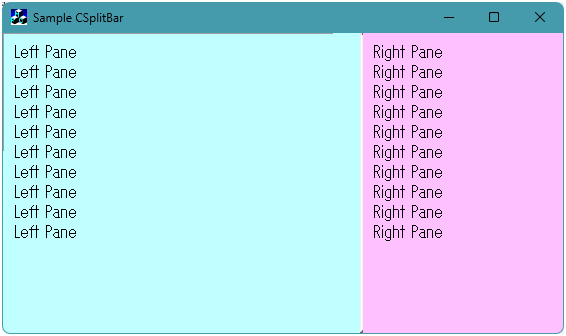

# SplitBar

MFC スプリッタ CSplitterBar




## 概要

他のコードや外部ライブラリに依存せず、単体で動作する MFC ダイアログ/ウィンドウ向けスプリッタバー実装クラス (`CSplitterBar`) です。  
Visual C++ 6.0 (VC6) などの古い開発環境から最新環境まで幅広く動作します。


---

## 特長

- **外部依存なし**: CSplitterBar 本体は `afxwin.h` のみに依存しています。
- **VC6 対応**: 古いコンパイラ環境・C++98 相当でもビルド・動作可能です。
- **伸縮モード対応**: 固定長（左/上固定、右/下固定）や比率維持など、ウィンドウリサイズ時の柔軟なレイアウトに対応します。
- **DPI 調整対応**: モニターの DPI（`LOGPIXELSX` / `LOGPIXELSY`）に合わせたバーサイズ・最小幅の自動スケーリングを行います。


---

## 構成ファイル

- `SplitBar.inc` : `CSplitterBar` クラスの実装ヘッダ
- `SplitBDg.h` / `SplitBDg.cpp` : ダイアログでの使用例サンプル


---

## 使用手順

### 1. ヘッダのインクルード

ダイアログのヘッダファイル（例: `SplitBDg.h`）で `SplitBar.inc` をインクルードし、メンバー変数を宣言します。

```cpp
#include "SplitBar.inc"

class CSplitBarDlg : public CDialog
{
    // ...
    CStatic         m_Left_Pane;  // 左ペイン
    CStatic         m_RightPane;  // 右ペイン
    CSplitterBar    m_Splitter;   // スプリッタバー本体
};

```

### 2. コントロールの初期化 (`OnInitDialog`)

ダイアログ初期化時にスプリッタバーを動的生成し、分割対象のコントロールを登録します。

```cpp
BOOL CSplitBarDlg::OnInitDialog()
{
    CDialog::OnInitDialog();
    //  ...
    // 1. スプリッタバーを動的に生成
    m_Splitter.Create(_T(""), WS_CHILD | WS_VISIBLE | SS_NOTIFY, CRect(0,0,0,0), this, 1300);
    // 2. スプリッタの初期化 (左右分割, バーサイズ: 3, 最小幅: 10, 右端固定モード)
    m_Splitter.Init(&m_Left_Pane, &m_RightPane, TRUE, 3, 10, CSplitterBar::ModeFixedRB);
    // 3. 右ペインの初期幅を設定
    m_Splitter.SetInitFixed(200);
    // 4. レイアウトの確定
    m_Splitter.PostRelayout();
    return TRUE;
}

```

### 3. リサイズ処理 (`OnSize`)

ダイアログの `WM_SIZE` ハンドラでスプリッタの再配置を実行します。

```cpp
void CSplitBarDlg::OnSize(UINT nType, int cx, int cy)
{
    CDialog::OnSize(nType, cx, cy);
    // スプリッタおよび管理下のコントロールを再配置
    m_Splitter.RelayoutAll();
}

```

---

## リサイズモード (`ResizeMode`)

`CSplitterBar` では、親ウィンドウのリサイズ時にどのように対になるペインを追従させるかを以下のモードから指定できます。

| モード | 説明 |
| --- | --- |
| `CSplitterBar::ModeFixedLT` | 左端（または上端）からの距離を維持
| `CSplitterBar::ModeFixedRB` | 右端（または下端）からの距離を維持
| `CSplitterBar::ModeRelative` | 分割比率を維持


---

## 免責事項

本ツールおよび公開しているソースコードの使用により生じたいかなる損害についても、著作者は一切の責任を負いません。ご自身の責任において利用してください。
引用・改変時は URL ( https://mish.work/ ) を明記してください。


---

* **作者:** Iwao ( https://mish.work/ )
* **Copyright:** (C) 2026 Iwao. All Rights Reserved.


